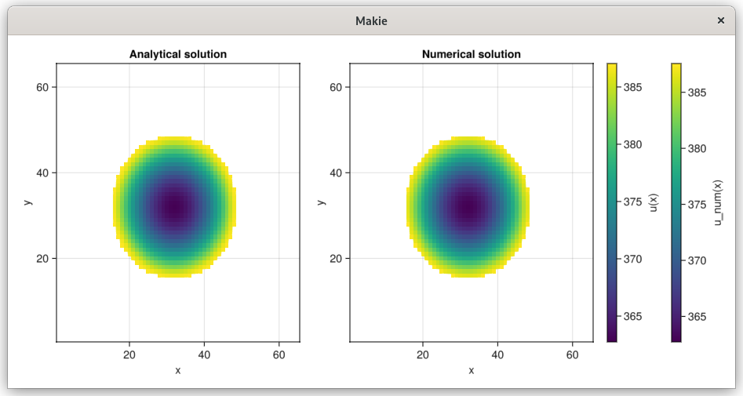
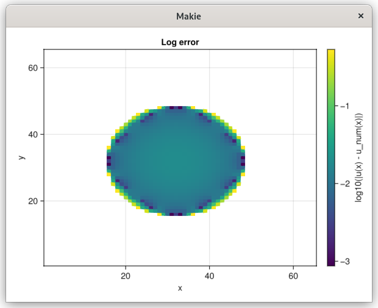

# 2D One‑Phase Heat Equation

This example demonstrates how to solve a 2D diffusion Heat equation inside a circular region with Robin boundary conditions

Here, we create a Cartesian mesh of size nx × ny, and define a circle inside that mesh.
The function identifies cells that lie inside, outside, or on the circular boundary.
```
# Build mesh
nx, ny = 192, 192
lx, ly = 4.0, 4.0
x0, y0 = 0.0, 0.0
domain = ((x0, lx), (y0, ly))
mesh = Mesh((nx, ny), (lx, ly), (x0, y0))

# Define the body
radius, center = ly/4, (2.01, 2.01)
circle = (x,y,_=0) -> (sqrt((x-center[1])^2 + (y-center[2])^2) - radius)
```

This creates the discrete operators needed to assemble and solve the diffusion equation based on the mesh and the circular domain.

```
# Define capacity/operator
capacity = Capacity(circle, mesh)
operator = DiffusionOps(capacity)
```

We impose Robin boundary conditions on the interface boundary and Dirichlet 400 on all edges, define a constant source term f(x,y)=0.0, and set the diffusion coefficient K=0.5.
```
bc = Robin(3.0,1.0,3.0*400)
bc0 = Dirichlet(400.0)
bc_b = BorderConditions(Dict{Symbol, AbstractBoundary}(:left => bc0, 
        :right => bc0, 
        :top => bc0, 
        :bottom => bc0))


f = (x,y,_)->0.0
K = (x,y,_)->0.5
phase = Phase(capacity, operator, f, K)
```

We build the initial conditions for the phase and concatenate them into one vector.
```
u0ₒ = ones((nx+1)*(ny+1)) * 270.0
u0ᵧ = zeros((nx+1)*(ny+1)) * 270.0
u0 = vcat(u0ₒ, u0ᵧ)

```

We set the time step Δt and a final time of Tend. Then, we build the unsteady solver for the monophasic case
and solve using the direct “backslash” method. The results (temperatures in the domain and at the interface)
are stored in solver.states over time.
```
Δt = 0.5*(lx/nx)^2
Tend = 1.0
solver = DiffusionUnsteadyMono(Fluide, bc_b, bc, Δt, Tend, u0, "BE")
solve_DiffusionUnsteadyMono!(solver, Fluide, u0, Δt, Tend, bc_b, bc, "BE"; method=Base.:\)
```


