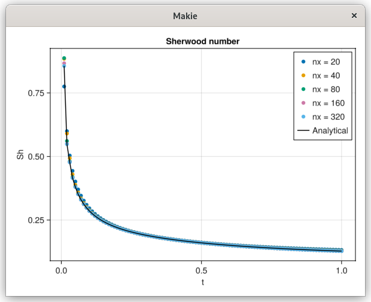

# 2D Two‑Phase Heat Equation

This example demonstrates a two‐phase unsteady diffusion problem using Penguin.jl in a two‐dimensional domain. It features:
- An 80×80 grid domain of size 8×8.  
- A disk interface that partitions the domain into two phases.  
- Dirichlet boundary conditions of zero on every side.  
- Unified solver, capacity, and operator components that handle both phases.

## Code Overview

```julia
using Penguin
using IterativeSolvers
using WriteVTK
using CairoMakie

# 1) Define Mesh
nx, ny = 80, 80
lx, ly = 8.0, 8.0
x0, y0 = 0.0, 0.0
mesh = Penguin.Mesh((nx, ny), (lx, ly), (x0, y0))

# 2) Define the Interface (Circle)
radius, center = ly/4, (lx/2, ly/2)
circle  = (x, y, _=0) ->  sqrt((x-center[1])^2 + (y-center[2])^2) - radius
circle_c = (x, y, _=0) -> -circle(x, y)

# 3) Create Capacities & Operators
capacity  = Capacity(circle,  mesh)
capacity_c = Capacity(circle_c, mesh)
operator   = DiffusionOps(capacity)
operator_c = DiffusionOps(capacity_c)

# 4) Boundary & Interface Conditions
bc    = Dirichlet(0.0)
bc_b  = BorderConditions(Dict(:left => bc, :right => bc, :top => bc, :bottom => bc))
ic    = InterfaceConditions(ScalarJump(1.0, 2.0, 0.0), FluxJump(1.0, 1.0, 0.0))

# 5) Define Phases
f_zero = (x, y, z, t)->0.0
Fluide_1 = Phase(capacity, operator, f_zero, (x, y, z)->1.0)
Fluide_2 = Phase(capacity_c, operator_c, f_zero, (x, y, z)->1.0)

# 6) Set Initial Condition
u0ₒ1 = ones((nx+1)*(ny+1))
u0ᵧ1 = ones((nx+1)*(ny+1))
u0ₒ2 = zeros((nx+1)*(ny+1))
u0ᵧ2 = ones((nx+1)*(ny+1))
u0   = vcat(u0ₒ1, u0ᵧ1, u0ₒ2, u0ᵧ2)

# 7) Time Setup & Solver Creation
Δt   = 0.01
Tend = 1.0
solver = DiffusionUnsteadyDiph(Fluide_1, Fluide_2, bc_b, ic, Δt, u0, "BE")

# 8) Solve
solve_DiffusionUnsteadyDiph!(solver, Fluide_1, Fluide_2, Δt, Tend, bc_b, ic, "CN"; method=Base.:\)

# 9) Visualization
plot_solution(solver, mesh, circle, capacity, state_i=101)
```

1. **Mesh**: A uniform grid is created with 80 cells along each axis, spanning 8×8 units.  
2. **Interfaces**: A disk defines the boundary between two phases: “gas” and “liquid.”  
3. **Operators**: Each phase uses a separate `Capacity` and `DiffusionOps`.  
4. **Boundary & Interface Conditions**: Dirichlet BCs fix the domain’s temperature at zero. The interface conditions define jumps in scalar fields and fluxes across the disk boundary.  
5. **Initial Condition**: Phase 1 is mostly set to 1 (ones array), while Phase 2’s bulk is set to 0.  
6. **Solver**: A diphasic unsteady solver is used, with adjustable time step (Δt) and total simulation time (Tend).  
7. **Execution**: The “Crank–Nicolson” method is chosen, and the solver iterates until the final time.  
8. **Postprocessing**: A variety of postprocessing options can be used (e.g., VTK export or plotting the solution via Makie).

This example can be adapted for other 2D setups by changing the geometry, boundary conditions, or time integration settings. For further exploration, uncomment the lines that write the solution to a VTK file or visualize intermediate states.


