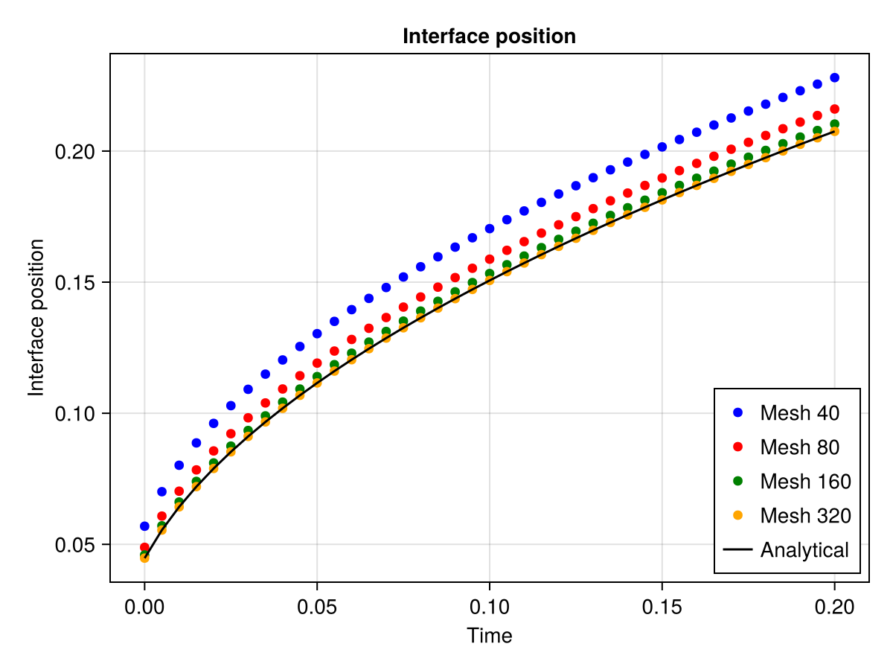

# 1D Stefan Problem

This example demonstrates how to solve a one‑phase Stefan problem where the interface position is computed via a Newton-based scheme (non‑prescribed motion). The problem is formulated as a moving liquid diffusion problem.

## Problem Setup

- **Mesh:** A 1D mesh with `nx` cells is defined on the domain `[0, lx]`.
- **Body:** The body is defined via a signed distance function with the initial interface located at `xf`.
- **Space‑Time Mesh:** A space‑time mesh is built with a time step Δt.
- **Capacity & Operator:** The capacity (geometry) and the diffusion operator are computed based on the moving domain.
- **Boundary Conditions:** Dirichlet conditions are imposed on the top and bottom boundaries.
- **Interface (Stefan) Conditions:** The flux jump is computed with parameters ρ and L. Newton parameters (max_iter and tol) are set to control convergence while computing the new interface position.
- **Solver:** The `MovingLiquidDiffusionUnsteadyMono` solver is used with a backward Euler scheme for stability.
- **Post‑Processing:** The script plots the Newton residuals over the iterations, the evolution of the interface position (xf_log), and the final temperature distribution.

## Governing Equations

The unsteady diffusion equation inside a moving domain is solved:
  
  ∂u/∂t = ∇·(D∇u) + f
  
with an interface condition based on a Stefan condition. The interface is not prescribed a priori; rather, its position is computed via a Newton loop aiming to balance the change in volume with the computed flux jump:
  
  Hₙ₊₁ − Hₙ − (1/(ρL))·Flux = 0
  
where H denotes the sum of the capacity (volumes) in the current and previous time levels.

## Example Code

```julia
using Penguin, IterativeSolvers, LinearAlgebra, SparseArrays, SpecialFunctions, LsqFit, CairoMakie

# Spatial mesh and domain
nx = 80; lx = 1.0; x0 = 0.0
mesh = Mesh((nx,), (lx,), (x0,))

# Body and initial interface position
xf = 0.03 * lx
body = (x, t, _=0) -> x - xf

# Space-Time mesh, capacity, and diffusion operator
Δt = 0.001; Tend = 0.1
STmesh = SpaceTimeMesh(mesh, [0.0, Δt], tag=mesh.tag)
capacity = Capacity(body, STmesh)
operator = DiffusionOps(capacity)

# Boundary and interface conditions
bc = Dirichlet(0.0)
bc_b = BorderConditions(Dict(:top => Dirichlet(0.0), :bottom => Dirichlet(1.0)))
stef_cond = InterfaceConditions(nothing, FluxJump(1.0, 1.0, 1.0))  # using ρ*L = 1.0

# Phase, initial condition, and Newton parameters
Fluide = Phase(capacity, operator, (x,y,z,t)->0.0, (x,y,z)->1.0)
u0 = vcat(zeros(nx+1), zeros(nx+1))
Newton_params = (100, 1e-6)

# Create and solve the moving liquid diffusion problem
solver = MovingLiquidDiffusionUnsteadyMono(Fluide, bc_b, bc, Δt, u0, mesh, "BE")
solver, residuals, xf_log = solve_MovingLiquidDiffusionUnsteadyMono!(solver, Fluide, xf, Δt, Tend, bc_b, bc, stef_cond, mesh, "BE"; Newton_params=Newton_params, method=Base.:\)

# Animate and plot the solution
animate_solution(solver, mesh, body)
```


