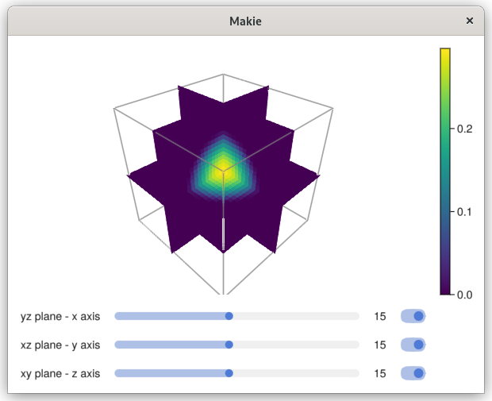

# Poisson 3D

This example demonstrates how to solve a 3D diffusion (Poisson) equation inside a spherical region.

Here, we create a Cartesian mesh of size nx × ny × nz, and define a circle inside that mesh.
The function identifies cells that lie inside, outside, or on the circular boundary.
```
# Build mesh
nx, ny, nz = 30, 30, 30
lx, ly, lz = 4., 4., 4.
x0, y0, z0 = 0., 0., 0.
domain = ((x0, lx), (y0, ly), (z0, lz))
mesh = Mesh((nx, ny, nz), (lx, ly, lz), (x0, y0, z0))

# Define the body
radius, center = ly/3, (lx/2, ly/2, lz/2) #.+ (0.01, 0.01, 0.01)
circle = (x,y,z)->(sqrt((x-center[1])^2 + (y-center[2])^2 + (z-center[3])^2) - radius)

```

This creates the discrete operators needed to assemble and solve the diffusion equation based on the mesh and the circular domain.

```
# Define capacity/operator
capacity = Capacity(circle, mesh)
operator = DiffusionOps(capacity)
```

We impose Dirichlet boundary conditions of 0.0 on all edges, define a constant source term f(x,y)=4.0, and set the diffusion coefficient K=1.0.
```
bc_interface = Dirichlet(0.0)
bc_b = BorderConditions(Dict(
    :left   => Dirichlet(0.0),
    :right  => Dirichlet(0.0),
    :top    => Dirichlet(0.0),
    :bottom => Dirichlet(0.0)))

f = (x,y,z)->4.0
K = (x,y,z)->1.0
phase = Phase(capacity, operator, f, K)
```

The solver is constructed and run using a direct solver (the “backslash” operator). The numerical solution is stored in solver.x.
```
solver = DiffusionSteadyMono(phase, bc_b, bc_interface)
solve_DiffusionSteadyMono!(solver; method=Base.:\)
```

